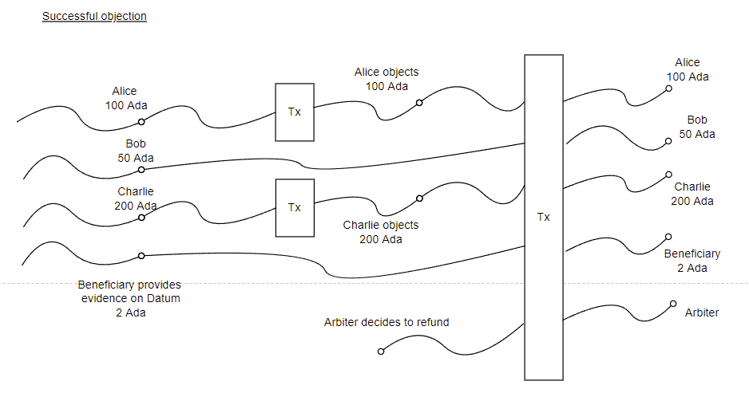

# agape

## Overview
Crowd source application, to compel something to happen by participants contributing a certain amount of Ada. The idea being, the more Ada is contributed, the more compelling it would be for the parties involved to satisfy the condition, for the payout to occur. 

Examples could be:
 - Person A to discuss with Person B on a certain topic on a platform such as YouTube. If this condition is satisfied, and YouTube evidence provided, then the crowd sourced amount is donated to charity C.
 - Person A to run a marathon by a certain date. If this condition is satisfied, then contributed amount donated to charity

If the above conditions happen, the accumulated Ada will be paid to Beneficiary C (could be multiple beneficiaries)

If the above conditions did not happen, then the accumulated Ada will be refunded to all crowd source participants.

Minting of a commemorative NFT token for every participant contributor, where we can link to an IPFS photo, and with descriptive text in the metadata on the conditions of the crowd source. This will be minted and sent to participants only on a successful crowd source.

There is also a role of an appointed Arbiter who will settle disputes.

Disputes occur if any of the participants are not satisfied with the outcome. An objection will be successful if a simple majority based on Ada amount is reached. If the objection is successful, then the arbiter steps in and decides on the outcome.

